  

<picture>
  <source media="(prefers-color-scheme: dark)" srcset="./assets/profile-card-dark.svg" />
  <source media="(prefers-color-scheme: light)" srcset="./assets/profile-card-light.svg" />
  
</picture>

### 🛠️ Stack

### 🚀 Featured work

| Project | What I did |
|---|---|
| **[D-Clinics](https://www.dclinics.uz)** | Lead frontend of a multi-module clinic ERP used by **50+ clinics** |
| **[D-Clinics Mobile](https://play.google.com/store/apps/details?id=com.dclinics.mobile)** | Ported the full ERP to React Native (Expo) — live on Google Play |
| **[CliniCall](https://clinicall.uz/en)** | System architecture + React analytics frontend (~100 calls/day) |
| **[RopAI](https://ropai.uz)** | Founder — AI sales assistant built solo, live with first customers |

### 📈 Activity

<picture>
  <source media="(prefers-color-scheme: dark)" srcset="https://raw.githubusercontent.com/khojiakbarr/khojiakbarr/output/github-snake-dark.svg" />
  <source media="(prefers-color-scheme: light)" srcset="https://raw.githubusercontent.com/khojiakbarr/khojiakbarr/output/github-snake.svg" />
  
</picture>

